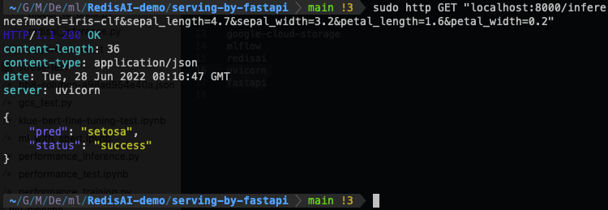
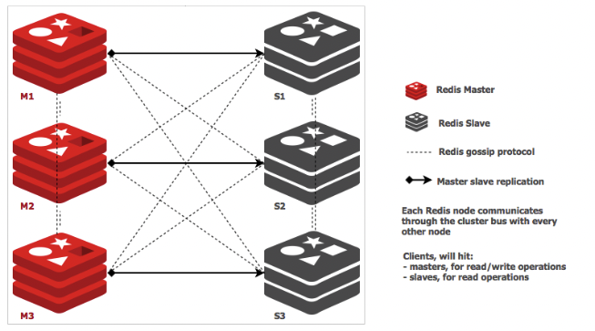
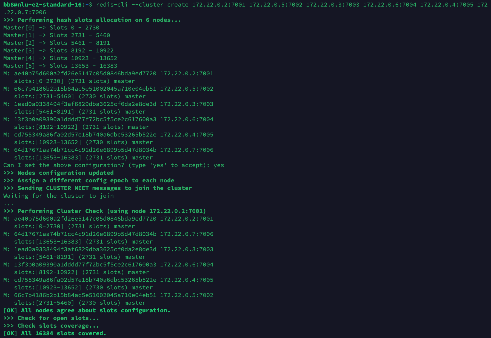
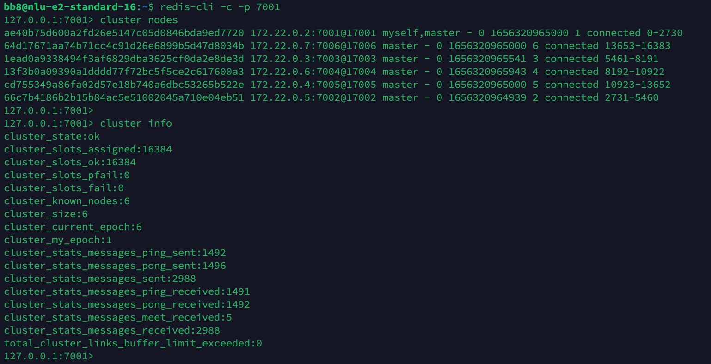
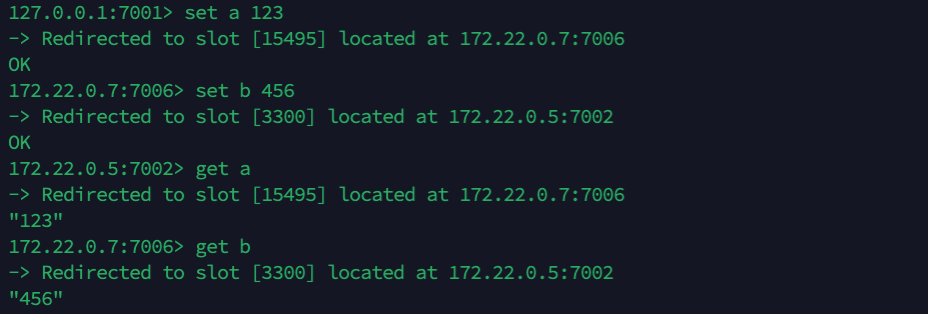
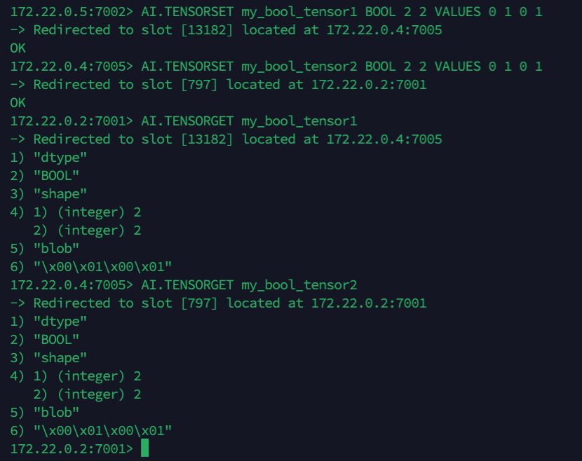

# RedisAI-demo

## Examples
 - [**serving-by-fastapi**](https://github.com/jaehyeongAN/RedisAI-demo#ex-1-serving-by-fastapi)
 - [**redis-cluster-by-docker-compose**](https://github.com/jaehyeongAN/RedisAI-demo#ex-2-redis-cluster-by-docker-compose)
<br>

## Ex 1. ⚡️ serving-by-fastapi
- 해당 데모는 FastAPI와 RedisAI를 활용한 간단한 모델 학습 및 추론 API 서버 구축을 목표로 합니다.
- FastAPI는 프록시 서버로서 endpoint를 제공하며 RedisAI Python SDK를 통해 모델 배포 및 추론을 RedisAI에 요청합니다.
- RedisAI는 학습된 모델을 저장/관리 및 추론 연산을 수행합니다. 

> RedisAI 및 해당 데모에 대한 자세한 설명은 [link](https://velog.io/@jaehyeong/MLOps-RedisAI-Cluster)를 참조.


### Setup
1. Git clone 
```bash
git clone https://github.com/jaehyeongAN/RedisAI-demo.git
```

2. Move to dir
```bash
cd RedisAI-demo/serving-by-fastapi
```

3. Install Dependencies
```bash
pip install -r requirements.txt
```

4. Run FastAPI server
```bash
uvicorn main:app 
```
<br>

### Endpoint 
1. <code>/train</code>
 - 1. Load iris dataset.
 - 2. Train model using LogisticRegression of sklearn.
 - 3. Conver sklearn model to ONNX model.
 - 4. Save ONNX model to RedisAI
```bash
http GET localhost:8000/train
```

2. <code>/inference</code>
 - 1. Check Model 
 - 2. Set input tensor to RedisAI
 - 3. Model execute
 - 4. Get result
```bash
http GET "localhost:8000/inference?model=iris-clf&sepal_length=4.7&sepal_width=3.2&petal_length=1.6&petal_width=0.2"
```


<br>

## Ex 2. 👨‍👩‍👧‍👦 redis-cluster-by-docker-compose
 - 해당 데모는 RedisAI Cluster 구축을 목표로 합니다.
 - 3 Master - 3 Replica 구성의 Cluster를 Docker Compose를 통해 구성합니다.



### Setup
1. Git clone 
```bash
git clone https://github.com/jaehyeongAN/RedisAI-demo.git
```
2. Move to dir
```bash
cd RedisAI-demo/redis-cluster-by-docker-compose
```

### 1. Create Docker Network
```bash
docker network create redis-cluster-net
```

### 2. Docker build
```bash
docker-compose up -d 
```
and check active containers.
```bash 
docker ps 
```
```
CONTAINER ID   IMAGE           COMMAND                  CREATED          STATUS         PORTS                                                                                                NAMES
e4d7aa428df8   bitnami/redis   "/opt/bitnami/script…"   9 seconds ago    Up 7 seconds   0.0.0.0:7006->7006/tcp, :::7006->7006/tcp, 6379/tcp, 0.0.0.0:17006->17006/tcp, :::17006->17006/tcp   bb8_redis-replica-3_1
ec8b62a9fcaa   bitnami/redis   "/opt/bitnami/script…"   9 seconds ago    Up 8 seconds   0.0.0.0:7004->7004/tcp, :::7004->7004/tcp, 6379/tcp, 0.0.0.0:17004->17004/tcp, :::17004->17004/tcp   bb8_redis-replica-2_1
89b27e18db2b   bitnami/redis   "/opt/bitnami/script…"   10 seconds ago   Up 8 seconds   0.0.0.0:7002->7002/tcp, :::7002->7002/tcp, 6379/tcp, 0.0.0.0:17002->17002/tcp, :::17002->17002/tcp   bb8_redis-replica-1_1
9046e000b996   bitnami/redis   "/opt/bitnami/script…"   10 seconds ago   Up 9 seconds   0.0.0.0:7001->7001/tcp, :::7001->7001/tcp, 6379/tcp, 0.0.0.0:17001->17001/tcp, :::17001->17001/tcp   bb8_redis-master-1_1
3e5a7be44d4b   bitnami/redis   "/opt/bitnami/script…"   10 seconds ago   Up 9 seconds   0.0.0.0:7003->7003/tcp, :::7003->7003/tcp, 6379/tcp, 0.0.0.0:17003->17003/tcp, :::17003->17003/tcp   bb8_redis-master-2_1
8ded224a87fc   bitnami/redis   "/opt/bitnami/script…"   10 seconds ago   Up 8 seconds   0.0.0.0:7005->7005/tcp, :::7005->7005/tcp, 6379/tcp, 0.0.0.0:17005->17005/tcp, :::17005->17005/tcp   bb8_redis-master-3_1
```

### 3. Inspect IpAddress of containers in RedisCluster Network.
 - we need to use command “docker network inspect rediscluster” to find out the IP assigned to each container and use that to create the Redis cluster.
 - Docker로 구성된 redis의 클러스터를 구축할 경우 docker container ip주소를 알아야 합니다.
```bash
docker network inspect redis-cluster-net
```
```
[
    {
        "Name": "redis-cluster-net",
        "Id": "11551db87e1ff61a5c103d00904b6864b1d89884ac53a8986594c8d07a844298",
        "Created": "2022-06-27T06:18:09.087045089Z",
        "Scope": "local",
        "Driver": "bridge",
        "EnableIPv6": false,
        "IPAM": {
            "Driver": "default",
            "Options": {},
            "Config": [
                {
                    "Subnet": "172.22.0.0/16",
                    "Gateway": "172.22.0.1"
                }
            ]
        },
        "Internal": false,
        "Attachable": false,
        "Ingress": false,
        "ConfigFrom": {
            "Network": ""
        },
        "ConfigOnly": false,
        "Containers": {
            "3e5a7be44d4b933377b884f440fc2451c4600e6b23598109f321265859bb7fb9": {
                "Name": "bb8_redis-master-2_1",
                "EndpointID": "ded51f76d16ac27bd890b04082cf2a43aa55dd3412af387588c9b78160268336",
                "MacAddress": "02:42:ac:16:00:04",
                "IPv4Address": "172.22.0.4/16",
                "IPv6Address": ""
            },
            "89b27e18db2bc7960b8ccd1b7518778aba0aed4723ed85a3bea7c75a6f7399d1": {
                "Name": "bb8_redis-replica-1_1",
                "EndpointID": "ad6419b620676cde246a248f7cb14df3a878aa4b624b5c2019fd8dce257faf2f",
                "MacAddress": "02:42:ac:16:00:05",
                "IPv4Address": "172.22.0.5/16",
                "IPv6Address": ""
            },
            "8ded224a87fc0719e94c9bf672ad44dd04954adbd3a1981b95a14559e948411f": {
                "Name": "bb8_redis-master-3_1",
                "EndpointID": "940784b968511e8ee3e27e855649e89f0f5ff2a225a2bc7a1e1cbf85d1ab27df",
                "MacAddress": "02:42:ac:16:00:03",
                "IPv4Address": "172.22.0.3/16",
                "IPv6Address": ""
            },
            "9046e000b9961fffe963cad4d85d194784e57ff485d469a721491a36ca17c485": {
                "Name": "bb8_redis-master-1_1",
                "EndpointID": "2136e2ef4f1022e9115bc82ca93df147fb90ff6513a6cf21721889e599bc8907",
                "MacAddress": "02:42:ac:16:00:02",
                "IPv4Address": "172.22.0.2/16",
                "IPv6Address": ""
            },
            "e4d7aa428df83a8fee3372a21a8adb3beb3848bd5ef66e42236af6410228ccd3": {
                "Name": "bb8_redis-replica-3_1",
                "EndpointID": "5785e36363f81386692b07bcf5e3301b6deba4a3252bb1ba0b490c26f0df790c",
                "MacAddress": "02:42:ac:16:00:07",
                "IPv4Address": "172.22.0.7/16",
                "IPv6Address": ""
            },
            "ec8b62a9fcaa0b1ebdd07685dbfe08dd8ba1e7e165ca38b9a22e2281da8f1dd5": {
                "Name": "bb8_redis-replica-2_1",
                "EndpointID": "93fedee81ba49bf6ac4d51be14bb126ec2fd630e2729b6477385bd7c274be65c",
                "MacAddress": "02:42:ac:16:00:06",
                "IPv4Address": "172.22.0.6/16",
                "IPv6Address": ""
            }
        },
        "Options": {},
        "Labels": {}
    }
]
```

### 4. Create Redis Cluster Group
Enter your host ip 
```bash
redis-cli --cluster create {mastser-1-host}:7001 {replica-1-host}:7002 {mastser-2-host}:7003 {replica-2-host}:7004 {mastser-3-host}:7005 {replica-3-host}:7006
```


and Check created cluster
```
redis-cli -c -p 7001

> cluster nodes
> cluster info
```



### 5. Test Redis Cluster
1. Basic Redis Commands
```
> set a 1
> set b 2
> set c 3

> get a 
> get b
> get c
```


2. RedisAI Commands
```
> AI.TENSORSET my_bool_tensor1 BOOL 2 2 VALUES 0 1 0 1
> AI.TENSORSET my_bool_tensor2 BOOL 2 2 VALUES 0 1 0 1

> AI.TENSORGET my_bool_tensor1
> AI.TENSORGET my_bool_tensor2
```

